### SQL Assessment Instructions

**Assessment Overview:**
This assessment is designed to evaluate your proficiency in SQL through practical tasks encompassing data manipulation, query formulation, and complex joins and subqueries. The questions are based on a fictional company named "TechShop," which sells electronic gadgets. TechShop maintains data related to their products, customers, and orders. Ensure to create your own data for testing your queries.

**Database Tables:**

1. **Customers:**

   - `CustomerID` (Primary Key)
   - `FirstName`
   - `LastName`
   - `Email`
   - `Phone`
   - `Address`

2. **Products:**

   - `ProductID` (Primary Key)
   - `ProductName`
   - `Description`
   - `Price`

3. **Orders:**

   - `OrderID` (Primary Key)
   - `CustomerID` (Foreign Key referencing Customers)
   - `OrderDate`
   - `TotalAmount`

4. **OrderDetails:**

   - `OrderDetailID` (Primary Key)
   - `OrderID` (Foreign Key referencing Orders)
   - `ProductID` (Foreign Key referencing Products)
   - `Quantity`

5. **Inventory:**
   - `InventoryID` (Primary Key)
   - `ProductID` (Foreign Key referencing Products)
   - `QuantityInStock`
   - `LastStockUpdate`

# Creating Database, Tables and Inserting Values
~~~SQL
Create database TechShop
use TechShop
Create Table Customers(CustomerID Int Primary Key,
						FirstName varchar(100),
						LastName varchar(100),
						Email nvarchar(100),
						Phone Int,
						Address nvarchar(100));

Insert into Customers values
(3001, 'Monkey D', 'Luffy', 'kingofpirates@1', 4626382, 'Fusia Village'),
(3002, 'Portgas D', 'Ace', 'firefist@2', 6548974, 'Grand Line'),
(3003, 'Roronoa', 'Zoro', 'kingofhell@3', 8437294, 'East Blue'),
(3004, 'Nico', 'Robin', 'littlemonster@4', 8784654, 'Ohara Village'),
(3005, 'Donquixote', 'Doflamingo', 'joker@5', 5645164, 'Dressrosa');

Create Table Products(ProductID Int Primary Key,
						ProductName varchar(100),
						Description varchar(100),
						Price Int);

Insert into Products values
(101, 'OnePlus 9 Pro', 'High-end smartphone', 25000),
(102, 'Samsung 4K TV', 'Large screen size', 70000),
(103, 'HP Envy Laptop', 'Powerful laptop', 65000),
(104, 'Sony Wireless Headphones', 'High-quality audio', 2000),
(105, 'Apple Watch Series 7', 'Advanced smartwatch', 15000);

Create Table Orders(OrderID Int Primary Key,
						CustomerID Int Foreign Key 
                  References Customers(CustomerID),
						OrderDate Date,
						TotalAmount Int);

Insert INTO Orders VALUES
    (1, 3001, '2022-01-01', 10000),
    (2, 3005, '2022-04-15', 80000),
    (3, 3003, '2022-10-01', 12000),
    (4, 3001, '2022-02-15', 15000),
    (5, 3003, '2022-02-01', 10000),
    (6, 3002, '2022-03-15', 12000),
    (7, 3004, '2022-04-01', 15000),
    (8, 3005, '2022-08-15', 10000);

Create Table OrderDetails(OrderDetailID Int Primary Key,
						OrderID Int Foreign Key 
                  References Orders(OrderID),
						ProductID Int Foreign Key 
                  References Products(ProductID),
						Quantity Int);

Insert INTO OrderDetails VALUES
(1131, 1, 101, 3),
(1132, 2, 103, 2),
(1133, 3, 102, 2),
(1134, 4, 101, 1),
(1135, 5, 104, 1),
(1136, 6, 105, 1),
(1137, 7, 102, 3),
(1138, 8, 104, 2);
						
Create Table Inventory(InventoryID Int Primary Key,
						ProductID Int Foreign Key References 
                  Products(ProductID),
						QuantityInStock Int,
						LastStockUpdate Date);

Insert INTO Inventory VALUES
(11, 101, 8, '2023-04-01'),
(12, 102, 6, '2023-04-15'),
(13, 103, 12, '2023-05-01'),
(14, 104, 10, '2023-05-15'),
(15, 105, 7, '2023-06-01');
~~~
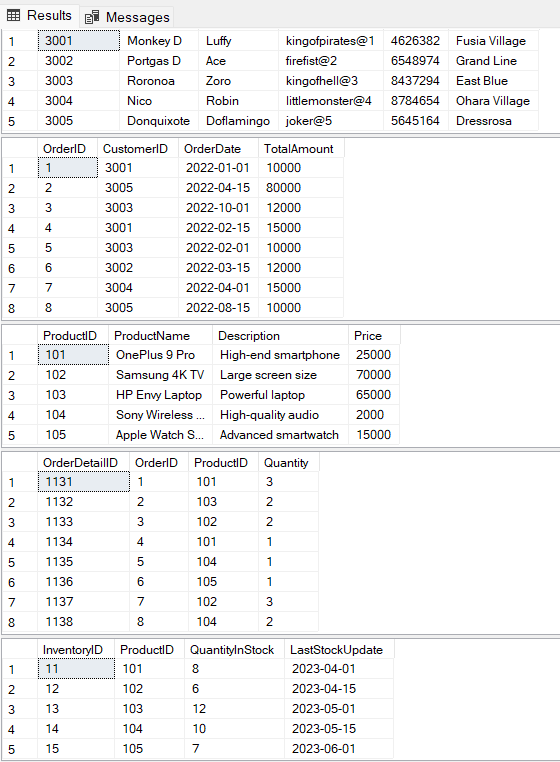

# Questions:

## 1. Write an SQL query to retrieve the names and emails of all customers.

~~~SQL
SELECT * FROM Customers;
SELECT CONCAT(FirstName, ' ', LastName) as FullName, Email FROM Customers;
~~~
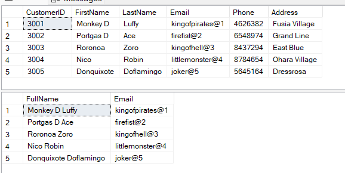

## 2. Write an SQL query to list all orders with their order dates and corresponding customer names.

~~~SQL
SELECT * FROM Customers;
SELECT * FROM Orders;
SELECT o.OrderID, c.CustomerID, CONCAT(c.FirstName, ' ', c.LastName) as CustomerName, o.OrderDate
FROM Orders as o
INNER JOIN Customers as c
ON o.CustomerID = c.CustomerID;
~~~
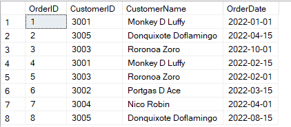

## 3. Write an SQL query to insert a new customer record into the "Customers" table. Include customer information such as name, email, and address.

~~~SQL
INSERT INTO Customers VALUES
(3006, 'Tony Tony', 'Chopper', 'Doctor@6', 4654156, 'Drum Island');
SELECT * FROM Customers
~~~
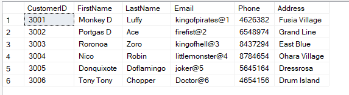

## 4. Write an SQL query to update the prices of all electronic gadgetsin the "Products" table by increasing them by 10%.

~~~SQL
UPDATE Products
SET Price = Price * 1.1;
SELECT * FROM Products
~~~
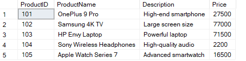

## 5. Write an SQL query to delete a specific order and its associated order details fromthe "Orders" and "OrderDetails" tables. Allow users to input the order ID as a parameter.

~~~SQL
SELECT * FROM Orders;
SELECT * FROM OrderDetails;

DELETE FROM Orders
WHERE OrderID = 3;

DELETE FROM OrderDetails
WHERE OrderID = 3;
~~~
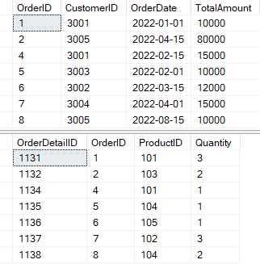

## 6. Write an SQL query to insert a new order into the "Orders" table.Include the customer ID, order date, and any other necessary information.

~~~SQL
SELECT * FROM Orders;
INSERT INTO Orders VALUES
(9,3004,'2022-08-19',17000);
~~~
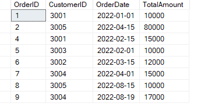

## 7. Write an SQL query to update the contact information (e.g., email and address) of a specific customer in the "Customers" table.Allow users to input the customer ID and new contact information.

~~~SQL
SELECT * FROM Customers;
UPDATE Customers
SET Email = 'captain@1',Phone = 9495447, Address = 'New World'
WHERE CustomerID = 3001;
~~~ 
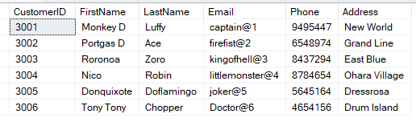

## 8. Write an SQL query to recalculate and update the total cost of each order in the "Orders" table based on the prices and quantities in the "OrderDetails" table.

~~~SQL
SELECT * FROM Orders;
SELECT * FROM OrderDetails;
SELECT * FROM Products;

UPDATE Orders
SET TotalAmount = (SELECT SUM(od.Quantity * p.Price)
					FROM OrderDetails od
					INNER JOIN Products p 
					ON od.ProductID = p.ProductID
					WHERE od.OrderID = Orders.OrderID);
~~~
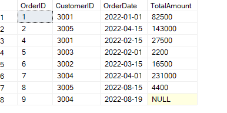

## 9. Write an SQL query to delete all orders and their associated order details for a specific customer from the "Orders" and "OrderDetails" tables. Allow users to input the customer ID as a parameter.

~~~SQL
SELECT * FROM OrderDetails
SELECT * FROM Orders

DELETE Orders
WHERE CustomerID = 3002;

DELETE OrderDetails
WHERE OrderID = (SELECT o.OrderID FROM Orders o
					WHERE o.CustomerID = (SELECT CustomerID FROM Customers c
					WHERE CustomerID = 3002));
~~~
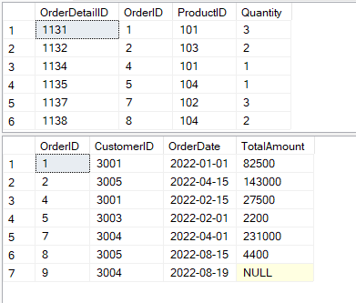

## 10. Write an SQL query to insert a new electronic gadget product into the "Products" table, including product name, category, price, and any other relevant details.

~~~SQL
SELECT * FROM Products;
INSERT INTO Products VALUES
(106, 'Apple Vision Pro', 'Advanced VR Experience', 200000);
~~~
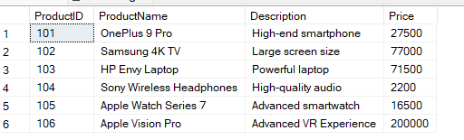

## 11. Write an SQL query to update the status of a specific order in the "Orders" table (e.g., from "Pending" to "Shipped"). Allow users to input the order ID and the new status.

~~~SQL
SELECT * FROM Orders

ALTER TABLE Orders
ADD Status varchar(60);

UPDATE Orders
SET Status = CASE
    WHEN OrderDate <= '2022-03-01' THEN 'Pending'
    WHEN OrderDate >= '2022-04-01' THEN 'Shipped'
END;
~~~
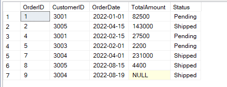

## 12. Write an SQL query to calculate and update the number of orders placed by each customer in the "Customers" table based on the data in the "Orders" table.

~~~SQL
SELECT * FROM Customers;

ALTER TABLE Customers
ADD OrderCount Int;

UPDATE Customers
SET OrderCount = (SELECT COUNT(o.OrderID)
					FROM Orders o
					WHERE o.CustomerID = Customers.CustomerID);
~~~
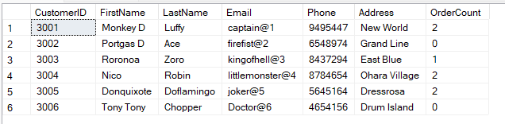

## 13. Write an SQL query to retrieve a list of all orders along with customer information (e.g., customer name) for each order.

~~~SQL
SELECT o.OrderID, o.CustomerID, CONCAT(c.FirstName, ' ', c.LastName) AS CustomerName, 
		o.OrderDate, o.TotalAmount, o.Status FROM Orders o
		INNER JOIN Customers c
		ON o.CustomerID = c.CustomerID;
~~~
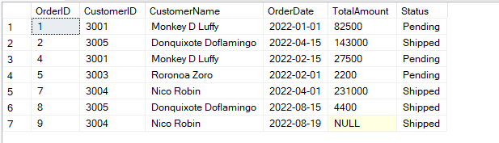

## 14. Write an SQL query to find the total revenue generated by each electronic gadget product.Include the product name and the total revenue.

~~~SQL
SELECT p.ProductName, SUM(od.Quantity * p.Price) AS TotalRevenue
			FROM Products p
			INNER JOIN OrderDetails od
			ON p.ProductID = od.ProductID
			GROUP BY p.ProductName;
~~~
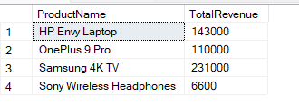

## 15. Write an SQL query to list all customers who have made at least one purchase. Include their names and contact information.

~~~SQL
SELECT c.CustomerID, CONCAT(c.FirstName, ' ', c.LastName) AS CustomerName,
		c.Email, c.Phone, c.Address
		FROM Customers c
		INNER JOIN Orders o
		ON c.CustomerID = o.CustomerID;
~~~
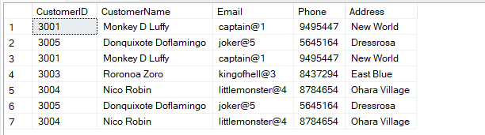
